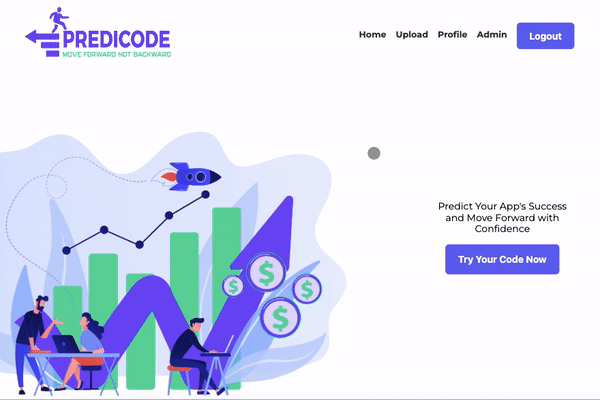

<br><br>

<!-- project philosophy -->


> A website that provides a predictive analysis of your app idea's potential for success, giving you the confidence to move forward with your project.
>
> Predicode is a user-friendly platform that empowers developers to predict their app's potential rating. By uploading your code to our system, you can gain confidence in your app's success and move forward with confidence. Our goal is to streamline the process and ensure customer satisfaction by providing an accurate prediction of your app's rating.

### User Stories

User

- As a user, I want to be able to input my app source code folder so that I can see if it will succeed and be able to improve it.
- As a user, I want to be able to input my app source code folder so that I can see if it will be maintainable and be able to improve it.
- As a user, I want to be able to edit my profile so that I can keep my information up-to-date and accurate.

Admin

- As an admin, I want to be able to display a list of all users with their app usage and feedback so that I can monitor the activity on the website.
- As an admin, I want to be able to view the codes tried on the app so that I can identify any issues and make necessary improvements.
- As an admin, I want to be able to view the history of user activity on my website so that I can understand how users are interacting with the site and identify any issues or areas for improvement.

<br><br>

<!-- Prototyping -->


> We designed Predicode using wireframes and mockups, iterating on the design until we reached the ideal layout for easy navigation and a seamless user experience.

### Wireframes

| Login screen                                        | Landing Page                                        | admin screen                                        |
| --------------------------------------------------- | --------------------------------------------------- | --------------------------------------------------- |
|  |  |  |

### Mockups

| Login screen                                  | Landing screen                                 | admin screen                                  |
| --------------------------------------------- | ---------------------------------------------- | --------------------------------------------- |
|  |  |  |

<br><br>

<!-- Implementation -->


> Using the wireframes and mockups as a guide, we implemented the Predicode Website with the following features:

### User Screens (Web)

Animated gifs

| Register screen                         | Sidebar screen                               | Upload screen                               |
| --------------------------------------- | -------------------------------------------- | ------------------------------------------- |
|   |        |      |
| Home screen                             | Update Picture screen                        | Edit infos screen                           |
|     |   |  |
| View History screen                     | Filtering Users screen                       | View Files screen                           |
|  |         |   |
|                                         | Google Signin screen                         |                                             |
|                                         |  |                                             |

<br><br>

<!-- Tech stack -->


### Predicode is built using the following technologies:

- This project uses the [Vite Next Generation Frontend Tooling](https://vitejs.dev/). Vite is a fast and efficient build tool and web development platform that simplifies the creation of modern and scalable web applications. It offers fast module reloading, supports popular front-end frameworks, and optimizes the build process for performance.
- With Vite we are using [React Js](https://react.dev/) a popular JavaScript library for building user interfaces, and it works seamlessly with Vite.
- For fast and scalable API development (backend), the website use [FastAPI framework](https://fastapi.tiangolo.com/). FastAPI is a modern, fast (high-performance), web framework for building APIs with Python 3.7+ based on standard Python type hints.
- For Efficient ML experimentation environment with visualization capabilities. We used [JupyterLab: A Next-Generation Notebook Interface](https://jupyter.org/). JupyterLab is the latest web-based interactive development environment for notebooks, code, and data. Its flexible interface allows users to configure and arrange workflows in data science, scientific computing, computational journalism, and machine learning. A modular design invites extensions to expand and enrich functionality.
- To develop our Machine Learning model, we used [Scikit-learn random forest regressor](https://scikit-learn.org/stable/index.html#). scikit-learn is a Python machine learning library with easy-to-use algorithms and tools for data preprocessing modeling, and evaluation.
- To optimize this model, we used [Distributed Evolutionary Algorithms in Python](https://github.com/deap/deap). DEAP is a Python library for implementing evolutionary algorithms for optimization tasks, with tools for parallelization and visualization.
- For persistent storage (database), the website uses the [Mongodb](https://www.mongodb.com/) package which allows the app to create a custom storage schema and save it to a local database.
- The app is [Dockerized](https://www.docker.com/) . Docker takes away repetitive, mundane configuration tasks and is used throughout the development lifecycle for fast, easy and portable application development – desktop and cloud.
- The app uses the font ["Montserrat"](https://fonts.google.com/specimen/Montserrat) as its main font, and the design of the app adheres to the material design guidelines.

<br><br>

<!-- How to run -->


> To set up Predicode locally, follow these steps:

### Prerequisites

Those are the prerequisites before installing the project

- npm

  ```sh
  npm install npm@latest -g
  ```

- Python

1. Open the official Python website https://www.python.org/downloads/
2. Scroll down to find the latest version of Python and download the installer package
3. Double-click the downloaded package file to launch the installer.
4. Follow the instructions in the installer to complete the installation process.

- MongoDB

  -For Mac

1. Download the MongoDB Community Server .tgz file from the official website: https://www.mongodb.com/try/download/community.
2. Open the downloaded .tgz file and extract the contents to a desired location.
3. Rename the extracted folder to mongodb.
4. Move the mongodb folder to the root directory (i.e., /) or to another preferred location.
5. dd MongoDB's binaries to the system path by adding the following line to your ~/.bash_profile file:

```sh
export PATH=<mongodb-install-directory>/bin:$PATH
```

6. Run the mongod command in a terminal window to start the MongoDB server.

For Windows

1. Download the MongoDB Community Server .msi file from the official website: https://www.mongodb.com/try/download/community.
2. Run the downloaded .msi file and follow the installation wizard.
3. Choose a custom installation location or keep the default location suggested by the installer.
4. Choose to install MongoDB as a service or not. Installing as a service allows MongoDB to start automatically when the computer starts.
5. Complete the installation by clicking the "Install" button.
6. Open a Command Prompt window and navigate to the bin folder of the MongoDB installation directory.
7. Run the mongod command in the Command Prompt window to start the MongoDB server.

### Installation

1. Clone the repo
   ```sh
   git clone https://github.com/jamesmahfouz/predicode
   ```
2. Navigate to the project frontend
   ```sh
   cd predicode/predicode-frontend
   ```
3. Install NPM packages
   ```sh
   npm install
   ```
4. Run the frontend
   ```sh
   npm run dev
   ```
5. Open another command-line
6. Go to the backend
   ```sh
   cd predicode-server
   ```
7. Create a virtual environment
   ```sh
   python3 -m venv my_venv
   ```
8. Deactivate virtual environment if you're in one
   ```sh
   deactivate
   ```
   OR, if you were in an anaconda virtual environment
   ```sh
   conda deactivate
   ```
9. Activate your virtual environement
   ```sh
   source my_venv/bin/activate
   ```
10. Install the requirements
    ```sh
    pip install -r requirements.txt
    ```
11. In the app directory in the configs folder create a new file named 'config.py' and copy config_example into it and fill it with your configuration
12. For the OPEN_AI_KEY go to https://platform.openai.com/account/api-keys, create an account and get your key.
13. In the public directory create a folder named "profile_pictures"
14. Go to the app directory
    ```sh
    cd app
    ```
15. Run the app
    ```sh
    uvicorn main:app --reload
    ```

Now, you should be able to run Predicode locally and explore its features.
