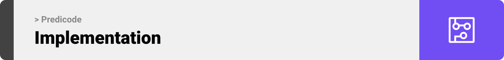

<br><br>

<!-- project philosophy -->


> A website that provides a predictive analysis of your app idea's potential for success, giving you the confidence to move forward with your project.
>
> Predicode is a user-friendly platform that empowers developers to predict their app's potential rating. By uploading your code to our system, you can gain confidence in your app's success and move forward with confidence. Our goal is to streamline the process and ensure customer satisfaction by providing an accurate prediction of your app's rating.

### User Stories

- As a new user, I want to be able to create an account on the website so that I can use the app source code checker feature.
- As a registered user, I want to be able to login to the website so that I can access my account and use the app source code checker feature.
- As a user, I want to be able to input my app source code folder so that I can see if it will succeed and be able to improve it.
- As an admin, I want to be able to display a list of all users with their app usage and feedback so that I can monitor the activity on the website.
- As an admin, I want to be able to view the codes tried on the app so that I can identify any issues and make necessary improvements.
- As a user, I want to be able to view the predicted rating of my app so that I can assess its potential success.
- As a user, I want to be able to compare the predicted ratings of multiple versions of my app so that I can make informed decisions about which version to release.
- As an admin, I want to be able to delete user accounts if necessary so that I can maintain the security and integrity of the website.
- As an admin, I want to be able to export a report of all user activity on the website so that I can analyze usage patterns and make improvements to the website.

<br><br>

<!-- Prototyping -->


> We designed Predicode using wireframes and mockups, iterating on the design until we reached the ideal layout for easy navigation and a seamless user experience.

### Wireframes

| Login screen                             | Register screen                          | admin screen                             |
| ---------------------------------------- | ---------------------------------------- | ---------------------------------------- |
|  |  |  |

| Landing Page                              | Landing Page                             | Landing Page                              |
| ----------------------------------------- | ---------------------------------------- | ----------------------------------------- |
|  |  |  |

### Mockups

| Login screen                          | Register screen                       | admin screen                          |
| ------------------------------------- | ------------------------------------- | ------------------------------------- |
|  |  |  |

| Landing Page                           | Landing Page                          | Landing Page                           |
| -------------------------------------- | ------------------------------------- | -------------------------------------- |
|  |  |  |

<br><br>

<!-- Implementation -->


> Using the wireframes and mockups as a guide, we implemented the Predicode Website with the following features:

### User Screens (Mobile)

| Login screen                              | Register screen                         | Landing screen                          | Loading screen                          |
| ----------------------------------------- | --------------------------------------- | --------------------------------------- | --------------------------------------- |
|  |  |  |  |
| Home screen                               | Menu Screen                             | Order Screen                            | Checkout Screen                         |
|  |  |  |  |

### Admin Screens (Web)

| Login screen                            | Register screen                       | Landing screen                        |
| --------------------------------------- | ------------------------------------- | ------------------------------------- |
|  |  |  |
| Home screen                             | Menu Screen                           | Order Screen                          |
|  |  |  |

<br><br>

<!-- Tech stack -->


### Coffee Express is built using the following technologies:

- This project uses the [Flutter app development framework](https://flutter.dev/). Flutter is a cross-platform hybrid app development platform which allows us to use a single codebase for apps on mobile, desktop, and the web.
- For persistent storage (database), the app uses the [Hive](https://hivedb.dev/) package which allows the app to create a custom storage schema and save it to a local database.
- To send local push notifications, the app uses the [flutter_local_notifications](https://pub.dev/packages/flutter_local_notifications) package which supports Android, iOS, and macOS.
  - 🚨 Currently, notifications aren't working on macOS. This is a known issue that we are working to resolve!
- The app uses the font ["Work Sans"](https://fonts.google.com/specimen/Work+Sans) as its main font, and the design of the app adheres to the material design guidelines.

<br><br>

<!-- How to run -->


> To set up Coffee Express locally, follow these steps:

### Prerequisites

This is an example of how to list things you need to use the software and how to install them.

- npm
  ```sh
  npm install npm@latest -g
  ```

### Installation

_Below is an example of how you can instruct your audience on installing and setting up your app. This template doesn't rely on any external dependencies or services._

1. Get a free API Key at [https://example.com](https://example.com)
2. Clone the repo
   ```sh
   git clone https://github.com/your_username_/Project-Name.git
   ```
3. Install NPM packages
   ```sh
   npm install
   ```
4. Enter your API in `config.js`
   ```js
   const API_KEY = "ENTER YOUR API";
   ```

Now, you should be able to run Coffee Express locally and explore its features.
